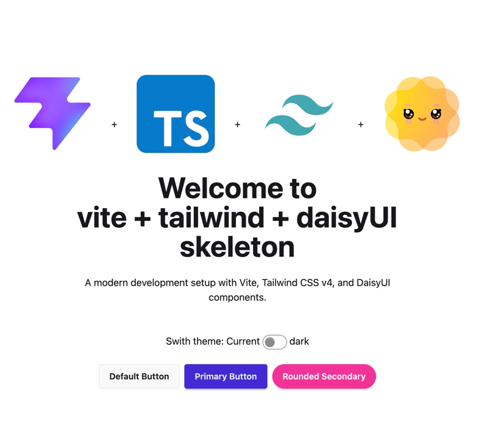

# Simple Vite + TS + TailwindCSS + DaisyUI Starter skeleton



## About

### Usage

- From the project directory enter the following commands:

```
$ pnpm i
$ pnpm dev
o #to open in the browser
```

### Technologies used

- vite
- ts
- tailwindcss
- daisyUI
- pnpm

#### Tailwind v4 Changes!

That eliminates the need for following pattern:

Tailwind v3 (old way):

```css
@tailwind base;
@tailwind components;
@tailwind utilities;
```

Tailwind v4 (new way - what we have):

```css
@import "tailwindcss";
```

### quick note about layer priotity

The Layer Order:

1. @layer base - Resets, defaults (lowest priority)
2. @layer components - Component classes
3. @layer utilities - Utility classes (highest priority)
4. Regular CSS after layers - Overrides everything
 
e.g. use `@layer base` to ensure utilities & components can override them. 
e.g. use `@layer components` to ensure utilities can override them. 